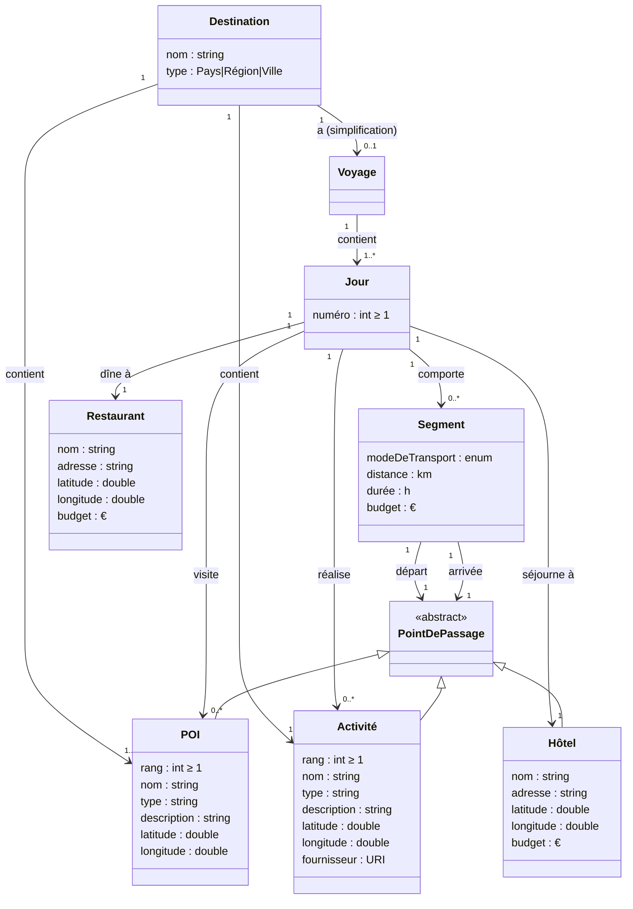

# Modèle de concepts

Le modèle de concepts s'articule autour de 3 concepts qui incarnent le `besoin` (les exigences du voyage) ...    
... et de 5 concepts qui incarnent la `solution` (la planification du voyage).

Les concepts `besoin` sont :
- La `Destination`
- Le `POI (Point Of Interest)`
- L'`Activité`

Les concepts `solution` sont :
- Le `Voyage`
- Le `Jour`
- Le `Segment`
- L'`Hôtel `
- Le `Restaurant `

## Les concepts qui incarnent le `besoin`

### Destination

Le 1er concept est le concept de `Destination`.    
Il est caractérisé par :    
- un `nom` : le nom de la destination (ex: "Italie", "Toscane", "Rome")    
- un `type` : Pays, Région, Ville  

Une `Destination` contient 1 ou plusieurs `POI(s)` associé(s) : relation 1-N.   
Une `Destination` contient 1 ou plusieurs `Activité(s)` associée(s) : relation 1-N.  
Une `Destination` peut en théorie avoir N `Voyages` associés (relation 1-N) ; toutefois, à ce stade du projet et par simplification, on ne gère qu'**1 seul `Voyage` par `Destination`** : la génération d'un nouveau voyage remplace le précédent.   

### POI (Point Of Interest)

Le 2nd concept est le concept de `POI` (Point Of Interest).   
Il est caractérisé par :   
- un `rang` : ordre de priorité du site à visiter
- un `nom` : le nom du site
- un `type` : nature, architecture, histoire, ...
- une `description`
- une `latitude`
- une `longitude`

Un `POI` appartient à une seule `Destination` : relation N-1.   
Un `POI` a une `latitude` et une `longitude` strictement déterminées.

### Activité

Le 3eme concept est le concept d'`Activité`.   
Il est caractérisé par :   
- un `rang` : ordre de priorité de l'activité à réaliser
- un `nom` : nom de l'activité
- un `type` : sport, culture, cuisine, ...
- une `description`
- une `latitude`
- une `longitude`
- un `fournisseur`

Une `Activité` appartient à une seule `Destination` : relation N-1.   
Une `Activité` est possiblement réalisable en différents lieux (couple `latitude` et `longitude`)
  
## Les concepts qui incarnent la `solution`

### Voyage

Le 1er concept est le concept de `Voyage`.   
Il représente la planification complète pour une `Destination` avec ses `POI(s)` et `Activité(s)` associés.        
Il est caractérisé par :   
- une liste de `Jours` (numérotés de 1 à N)

### Jour

Le 2nd concept est le concept de `Jour`.   
Il est utilisé pour la planification du `Voyage`.      
Un `Jour` contient un nombre fini de `Segment`, qui incarne le trajet d'un `Hôtel` de départ à un `Hôtel` d'arrivée en passant par 0, 1 ou plusieurs `POI(s)` et/ou `Activité(s)`.   
Il est caractérisé par :   
- un `numéro` : le numéro du jour dans le voyage (Jour 1, Jour 2, ..., Jour N).    
- une liste de `POI(s)` à visiter ce jour-là.
- une liste d'`Activité(s)` à réaliser ce jour-là.   
- un `Hôtel` recommandé pour la nuit.      
- un `Restaurant` recommandé pour le dîner.     
Chaque `Jour` est caractérisé en outre par la somme des `distances` et `durées` de chaque `Segment` et par la somme du `budget` de chaque `Segment`, `Hôtel` et `Restaurant`.

### Segment
Chaque `Segment` a un 1 point de départ et 1 point d'arrivée   
- ces points peuvent être soit des `Hôtels`, soit des `POI(s)`, soit des `Activité(s)`  (Pas les `Restaurants`)
Chaque `Segment` a un `mode de transport` affecté : pied, vélo, voiture (personnelle, location, taxi), bus, métro, train, bateau, avion.  
Chaque `Segment` est caractérisé par :
- Une `distance` (en km)
- Une `durée` (en heure)
- Un `budget` (en Euro)

### Hôtel
Chaque `Hôtel` est caractérisé par :   
- `nom`
- `adresse`
- `coordonnées GPS` (`latitude`, `longitude`)
- `budget`

### Restaurant
Chaque `Restaurant` est caractérisé par :   
- `nom`
- `adresse`
- `coordonnées GPS` (`latitude`, `longitude`)
- `budget`

## Diagramme

## Formalisation OWL

Le modèle ci-dessus est formalisé en OWL 2 dans [`concept_model.ttl`](concept_model.ttl) (Turtle, 396 triples : 8 classes + 1 union `PointDePassage`, 15 object properties avec inverses, 15 datatype properties, axiomes de cardinalité, énumérations fermées pour `TypeDestination` et `ModeDeTransport`, disjonction des classes principales).

Un jeu d'individus de validation (voyage 2 jours au Japon : Tokyo → Kyoto) est fourni dans [`concept_model.examples.ttl`](concept_model.examples.ttl).

Ces fichiers sont chargeables dans Protégé, GraphDB, Apache Jena, ou tout autre outil RDF/OWL.
